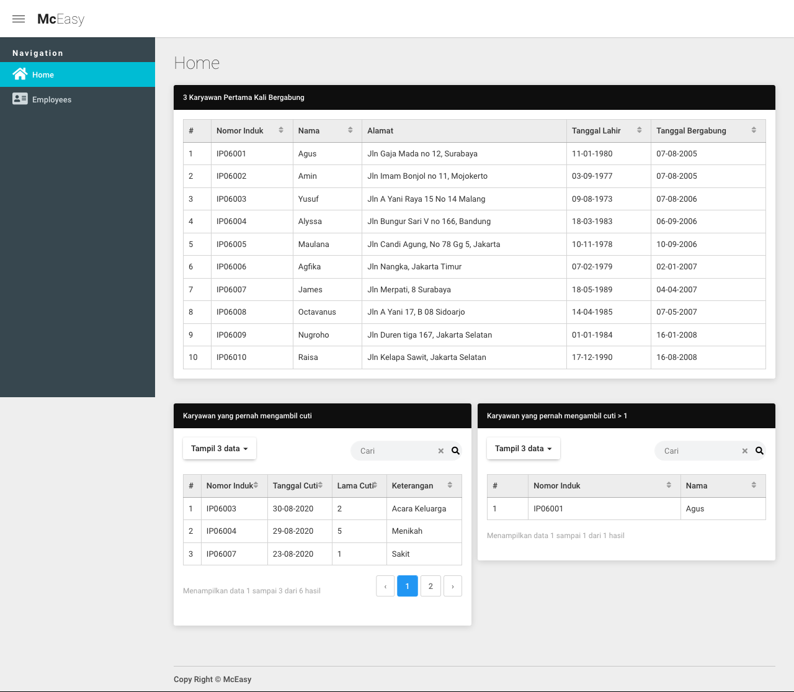
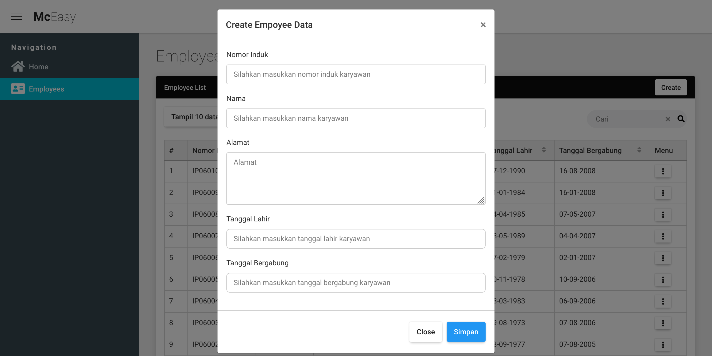

<p align="center">
<h1 align="center">McEasy Test</h1>
</p>

## About Project
Project Stack:
- Programming Language PHP
- Framework [Laravel 8](https://laravel.com/docs/8.x/installation).
- UI Framework [Laravel Livewire](https://laravel-livewire.com/docs/2.x/quickstart)
- Database MariaDB.

<br>

## Requirement
1. PHP 7.4+
2. MySql 5.7+ / MariaDB 10+
3. Node 10+ and NPM 5+
4. BCMath PHP Extension
5. Ctype PHP Extension
6. Fileinfo PHP Extension
7. JSON PHP Extension
8. Mbstring PHP Extension
9. OpenSSL PHP Extension
10. PDO PHP Extension
11. Tokenizer PHP Extension
12. XML PHP Extension

<br>

## RUN In Development mode
- config .env -> use .env.example as reference 
- Setup Database in .env file
- ```
    composer install
  ```
- ```
    npm install && run dev
  ```
- ```
    php artisan migrate
    php artisan db:seed
  ```

<br>

## Screenshoot
1. Home page

2. Employee page

3. Create Employee

<br>
