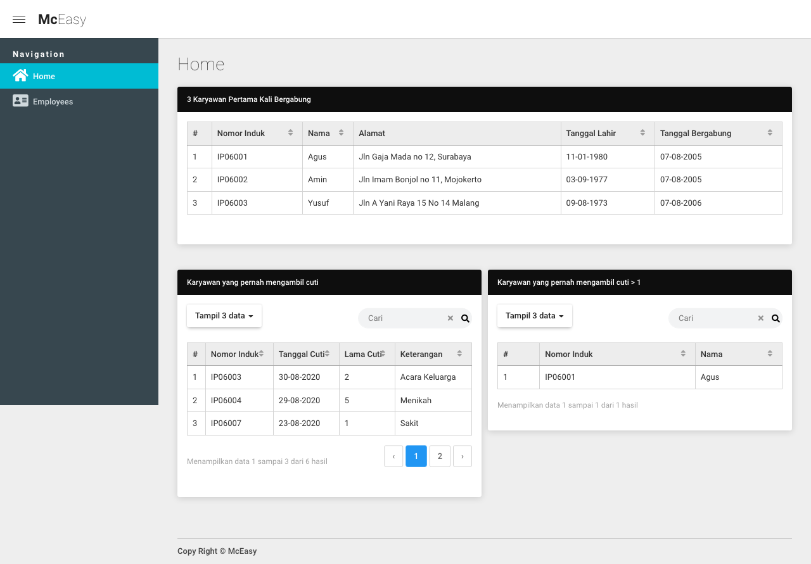
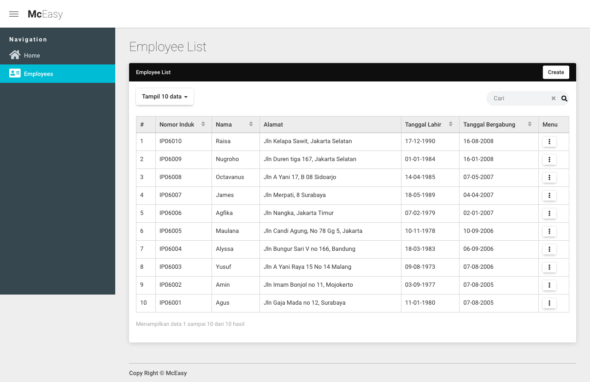

<h1 align="center">McEasy Test</h1>

## About Project
Project Stack:
- Programming Language PHP
- Framework [Laravel 8](https://laravel.com/docs/8.x/installation).
- UI Framework [Laravel Livewire](https://laravel-livewire.com/docs/2.x/quickstart)
- Database MariaDB.

 

## Requirement
1. PHP 7.4+
2. Node 10+ and NPM 5+
3. BCMath PHP Extension
4. Ctype PHP Extension
5. Fileinfo PHP Extension
6. JSON PHP Extension
7. Mbstring PHP Extension
8. OpenSSL PHP Extension
9. PDO PHP Extension
10. Tokenizer PHP Extension
11. XML PHP Extension

 

## RUN In Development mode
- config .env -> use .env.example as reference 
- Setup Database in .env file
- composer install
- npm install && run dev
- php artisan migrate
- php artisan db:seed

 

## Screenshoot
1. Home page

2. Employee page

3. Create Employee

 
